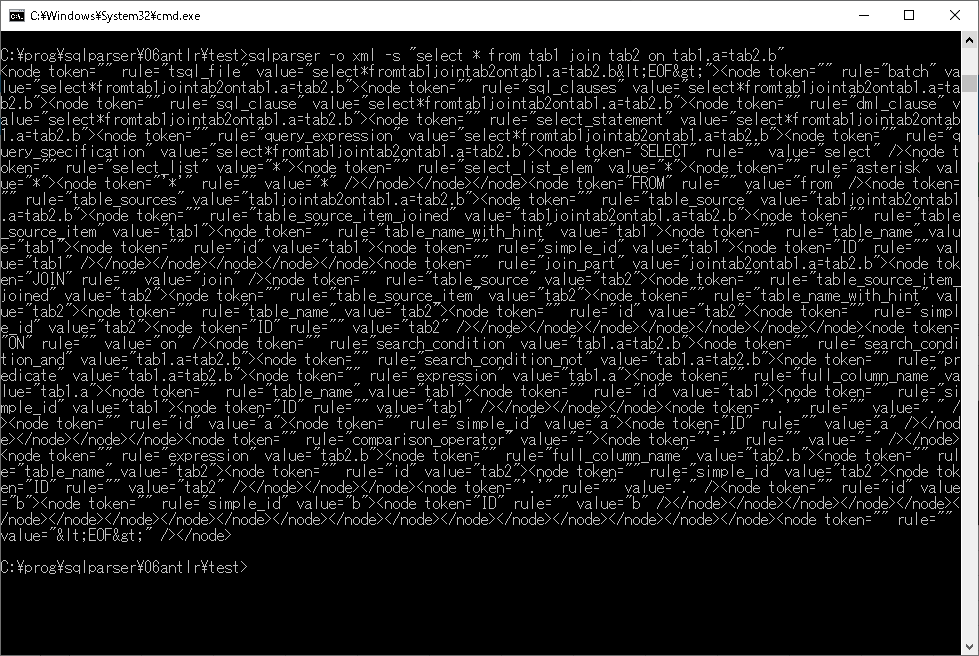
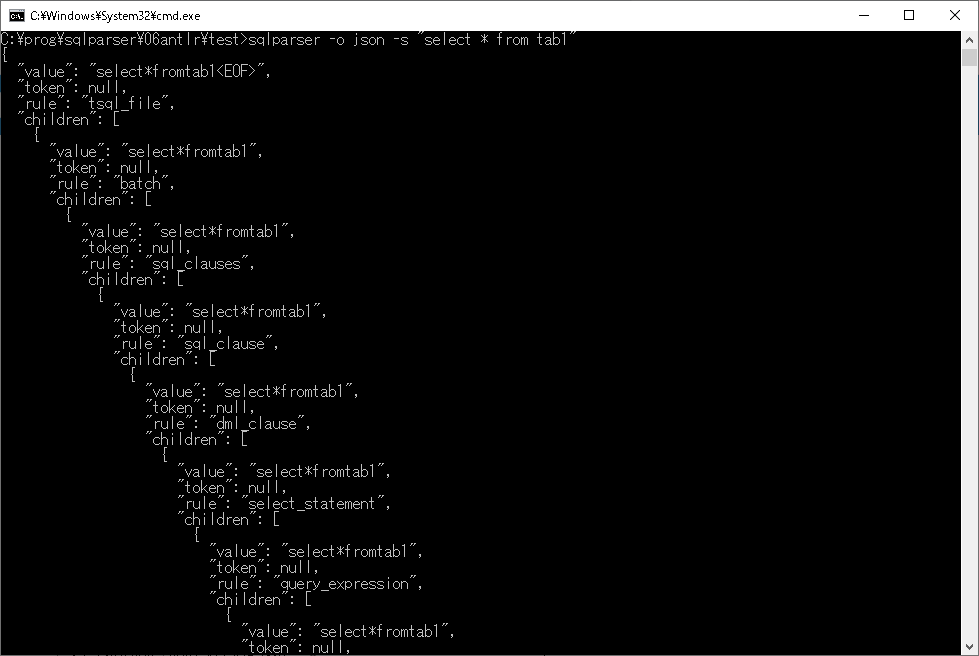

# ANTSQLParser

<!-- # Short Description -->

TSQL parser program with ANTLR4 and great contributors.

<!-- # Badges -->

[](https://github.com/GCer-Hidenori/ANTSQLParser/issues)
[](https://github.com/GCer-Hidenori/ANTSQLParser/network/members)
[](https://github.com/GCer-Hidenori/ANTSQLParser/stargazers)
[](https://github.com/GCer-Hidenori/ANTSQLParser/)
[](https://github.com/GCer-Hidenori/ANTSQLParser/)

# Tags

`tsql` `sql parser`

# Demo

sqlparser -o xml -s "select * from tab1 join tab2 on tab1.a=tab2.b"  


sqlparser -o json -s "select * from tab1"



# Advantages

this program support
- dml
  - merge
  - delte
  - insert
  - select
  - update
- ddl
  - alter
  - create
  - drop
  - etc
- backup statement
- flow control statement
  - begen
  - break
  - if
  - goto
  - return
  - throw
  - try
  - etc

# Installation

git clone https://github.com/GCer-Hidenori/ANTSQLParser.git

# Minimal Example

## output format
- XML  
```sqlparser -o xml -s "select * from tab1 join tab2 on tab1.a=tab2.b"```
- json  
```sqlparser -o json -s "select * from tab1 join tab2 on tab1.a=tab2.b"```
## input format
- string  
```sqlparser -o json -s "select * from tab1 join tab2 on tab1.a=tab2.b"```
- file  
```sqlparser -o json -f select01.sql -e utf-8```

# Contributors

- [GCer-Hidenori](https://github.com/GCer-Hidenori)

<!-- CREATED_BY_LEADYOU_README_GENERATOR -->
